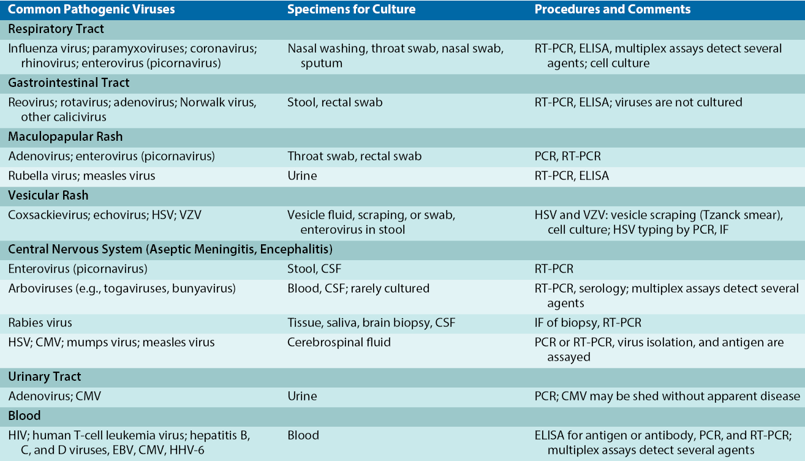
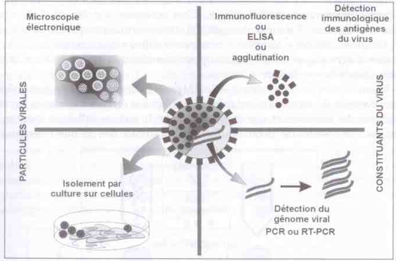
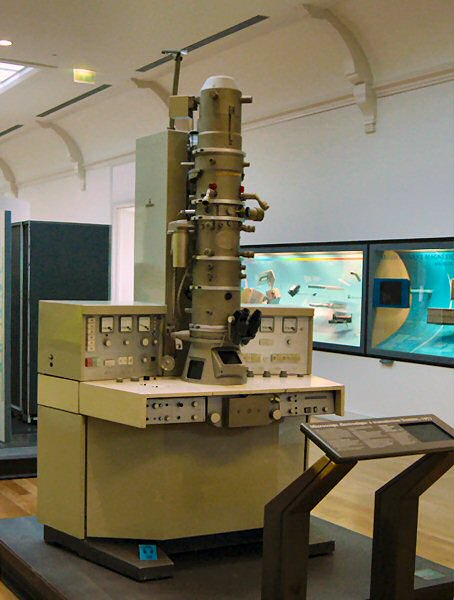
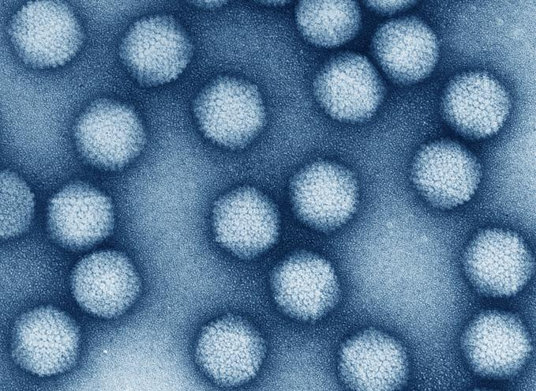
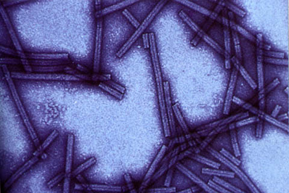
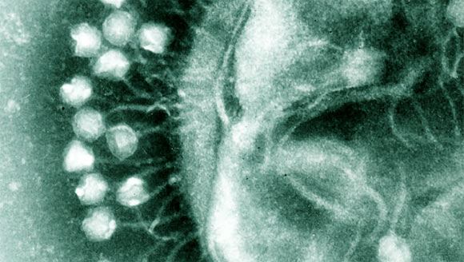
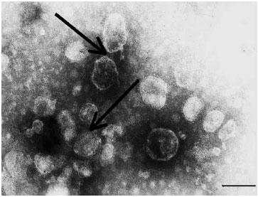
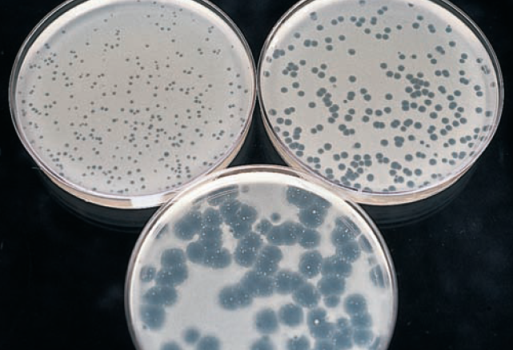
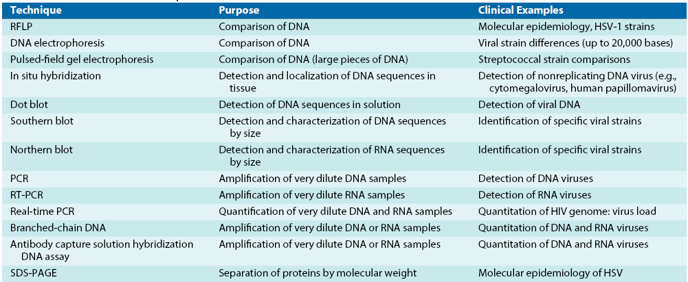
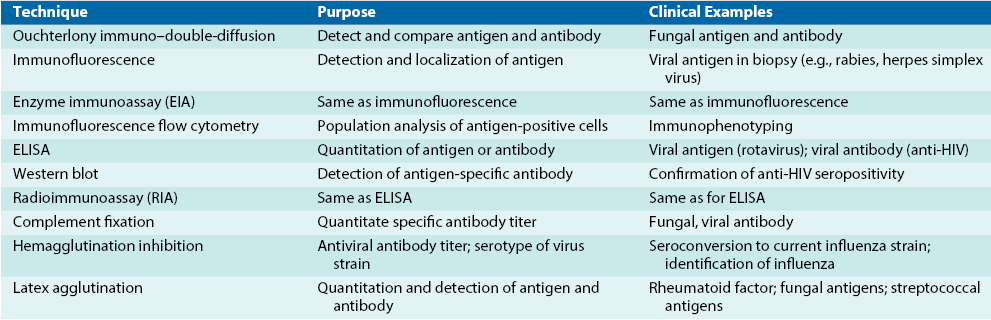

## Objectives
<!-- 3h for this session -->

After this session the students should be able to:

- Demonstrate the importance of diagnosis in virology
- Identify the laboratory procedure for diagnosis in virology
- Explain the cell culture to identify virus in medical laboratory
- Describe the techniques that detect viral protein to identify virus in medical laboratory
- Illustrate the principle of ELISA and PCR technique

##
<iframe sandbox='allow-scripts allow-same-origin allow-presentation' src='https://www.mentimeter.com/app/presentation/al6ccz3omiymnh2gqksqcew4xcju8k9u/embed'></iframe>

:::{.notes}
What is a key challenge in viral diagnostics that can lead to false negatives?
A) Overly sensitive tests
B) Low viral load and timing of specimen collection
C) Excessive lab automation
D) Patient age

Correct Answer: B (Low viral load and poor timing can reduce detection rates.)
Name a diagnostic method that directly detects viral genetic material in a sample.
Expected Answer: PCR (or nucleic acid amplification tests like RT-PCR).

What is the primary advantage of using cell culture for viral diagnosis?
A) It's the cheapest method
B) It allows virus isolation and further characterization
C) It only detects antibodies
D) It requires no special equipment

Correct Answer: B (Cell culture grows the virus for identification and study.)

Which diagnostic technique is best for detecting viral antigens in a patient's blood?
Expected Answer: ELISA (or immunoassays that detect antigens).

Which diagnostic approach measures the host's immune response to a virus?
A) Direct antigen detection
B) Nucleic acid amplification
C) Serology (antibody testing)
D) Virus isolation

Correct Answer: C (Serology tests for antibodies produced by the immune system.)
:::

## Case study {.font14}
A 28-year-old woman presents with fever, fatigue, and a rash. These symptoms appeared two days ago. She recently returned from a tropical vacation.

1. What viral infection could most likely be responsible for her illness?
2. What specimen(s) would you collect for laboratory diagnosis?
3. When is the best time to collect the specimen — at symptom onset or later — and why does timing matter?
4. What laboratory test(s) can be performed to confirm the suspected viral infection?

:::{.notes}
1. Possible virus: Dengue virus (Other differentials: Zika virus, Chikungunya virus, measles—depending on clinical details and exposure.)

2. Specimen(s) to collect:
Serum or plasma (for serology and molecular tests)
Whole blood (for RT-PCR)
Urine (especially for Zika virus detection)

3. Diagnostic test(s):
RT-PCR for viral RNA detection (within first 5–7 days of illness)
IgM and IgG ELISA (for serological confirmation in later stages)

:::

<!-- ## Case vignette

A 28-year-old woman presents with fever, fatigue, and a rash. These symptoms appeared two days ago.
She recently returned from a tropical vacation.

👉 **Task**:
Work in groups to diagnose the possible illness and suggest appropriate laboratory tests to confirm the diagnosis and why? -->

## Group discussion

How to diagnose these viruses and explain the principle of the tests:

- *Smallpox virus* (SPV)
- *Human papillomavirus* (HPV)
- *Rotavirus* (RV)
- *Adenovirus*
- *Human immunodeficiency virus* (HIV)
- *Coronavirus* (SARS-CoV-2)
- *Dengue virus* (DENV)

## Introduction {.font14}

- Why diagnostics matter:
  - Enable timely, targeted treatment and infection control
  - Inform public-health responses, surveillance, and outbreak investigation

- What diagnostic methods can do:
  - Detect virus directly (particles, antigens, genomes)
  - Isolate and grow virus for characterization (culture)
  - Measure host response (antibodies) for retrospective diagnosis or immunity assessment
  - Quantify viral load and identify variants (qPCR, sequencing)

## Introduction (cont.)
- Key challenges in viral diagnosis:
  - Timing of specimen collection and specimen quality affect sensitivity
  - Viral diversity and low loads can reduce detection rates

{ width=70% style="display: block; margin-left: auto; margin-right: auto;" }

## Specimen collection:

- Choose specimens based on suspected virus and clinical presentation
- Collect samples early in the acute phase for highest viral yield
- Antibody response may interfere with virus detection—timing is critical
- Use proper transport media with antibiotics and proteins to preserve sample integrity
- Keep specimens cold (usually 2-8°C) and process promptly to ensure accurate results

::: {.notes}
Proper specimen collection is the first critical step in viral diagnostics. Emphasize the importance of timing and handling to maintain sample viability.
:::

## Specimen collection

{ width=100% style="display: block; margin-left: auto; margin-right: auto;" }

::: {.notes}
This image illustrates proper specimen collection techniques. Discuss the types of samples and transport requirements.
:::

## Diagnosis technique (cont.)

{ width=100% style="display: block; margin-left: auto; margin-right: auto;"}

::: {.notes}
Here we see the four main groups of diagnostic techniques: morphological, immunological, molecular, and serological. Each has its strengths for different viruses.
:::

## Diagnosis technique (cont.)

Key laboratory procedures:

- Electron microscopy
- Virus isolation and culture
- Cytologic examination
- Antigen/protein detection (immunoassays)
- Serology (antibodies / antigens)
- Genome detection (PCR / sequencing)

::: {.notes}
Introduce the four broad approaches—morphology, culture, immunologic and molecular—then mention trade-offs (speed vs sensitivity vs specificity) and when each is preferred.
:::

## Electron microscopy

- Direct visualization of viral particles using negative staining
- Useful for detecting non-culturable viruses (e.g., _Rotavirus_)
- Sensitivity increased with virus-specific antibodies
- Limited routine use; mainly for rapid identification

  
  
  
  
  

::: {.notes}
Electron microscopy provides direct visualization of viruses. It's particularly useful for viruses that can't be cultured, like Rotavirus. The images show different viral morphologies.
:::

## Electron microscopy (cont.)
<iframe src="https://www.youtube.com/embed/9DnnxvS6BBQ" title="https://www.youtube.com/embed/9DnnxvS6BBQ"></iframe>

## Cell culture {.smaller}

- To grow and isolate virus from clinical specimens
- To observer cytopathic effects (CPE)
- To identify, quantify, and characterize viruses
- To produce live attenuated vaccines

| **Type**                         | **Source & Characteristics**                                                                 | **Typical Uses**                        | **Lifespan**               |
|:----------------------------------|:-------------------------------------------------------------------------------------------|:----------------------------------------|:---------------------------|
| **Primary Cell Culture**          | Directly isolated from animal or human tissue; closely resemble normal cells                | Virus isolation, vaccine production      | Short (few divisions)      |
| **Diploid Cell Line**             | Derived from normal cells; maintain diploid chromosome number; limited subcultures          | Diagnostic assays, research              | Moderate (20–50 divisions) |
| **Continuous / Tumor Cell Line**  | Transformed or cancer-derived; immortalized; easy to maintain; may have abnormal features   | Routine virus culture, genetic studies   | Long / Infinite            |

::: {.notes}
Cell culture involves growing viruses in living cells. Different cell types are used depending on the virus. CPE is a key indicator of viral infection.
:::

::: {.notes}
Speaker tip: When discussing CPE, show 1–2 example images and explain how time-to-CPE and cell tropism help narrow down the virus. Mention biosafety considerations briefly.
:::

## Cell culture {.smaller}
::::{.columns}
::: {.column width="70%"}
- Detect viruses by observing CPE, immunofluorescence, or genome analysis
- Identify viruses by cell type, and growth speed
- Quantify virus using:

| **Method**      | **Measures**                  | **Description**                          |
|-----------------|------------------------------|------------------------------------------|
| **TCD₅₀**       | Infectious virus concentration| Dilution causing CPE in 50% of cultures. |
| **LD₅₀**        | Virus lethality              | Dilution lethal to 50% of animals.       |
| **ID₅₀**        | Infectivity in vivo          | Dilution infecting 50% of animals.       |
| **Plaque Assay**| Infectious units (PFU/mL)    | Count plaques for virus quantification.   |

:::
::: {.column width="30%"}
{ width=100%  style="display: block; margin-left: auto; margin-right: auto;"}
:::
::::

##
<iframe src="https://www.youtube.com/embed/R2SOETtw9YA" title="https://www.youtube.com/embed/R2SOETtw9YA"></iframe>

## Detection of viral proteins

- Enzymes and other proteins -> detected by biochemical, immunologic, and molecular biology
- Viral proteins -> separated by electrophoresis -> identify and distinguish different viruses

- Monoclonal or monospecific antibodies -> distinguishing viruses (antigens on cell surface or within cell) -> detected by immunofluorescence and enzyme immunoassay (EIA).

- Virus or antigen released from infected cells -> detected by enzyme-linked immunosorbent assay (ELISA), and latex agglutination (LA).

::: {.notes}
Viral proteins can be detected through various immunological and biochemical methods. Antibodies play a key role in these assays.
:::

## Detection of viral proteins

Technique:

- Protein patterns (electrophoresis)
- Enzyme activities (e.g., reverse transcriptase)
- Hemagglutination and hemadsorption
- Antigen detection (e.g., direct and indirect immunofluorescence, enzyme-linked immunosorbent assay)

::: {.notes}
Specific techniques for protein detection include electrophoresis for patterns and assays like ELISA for antigens.
:::

## Detection of viral genetic material

Modern molecular techniques for detecting viral genetic material:

- **PCR & RT-PCR:** amplify and detect viral DNA/RNA
- **qPCR:** quantifies viral load
- **Electrophoresis:** analyzes RNA/DNA size and segments
- **Blotting (Southern/Northern):** identifies specific viral genes
- **Genome sequencing:** comprehensive virus identification

::: {.notes}
Speaker note: Emphasize that molecular methods are frontline for many viruses—fast and sensitive—but require strict controls to avoid contamination. Mention clinical uses: diagnosis, viral load monitoring, and variant detection.
:::

## Electrophoresis
<iframe src="https://www.youtube.com/embed/IeNcg9uK17M" title="Electrophoresis Animation"></iframe>

::: {.notes}
Note: Use this short animation to explain how molecules separate by size and why that's useful for identifying viral proteins or genome segments.
:::

## PCR
<iframe src="https://www.youtube.com/embed/8GOKaZ8MRyM" title="PCR Animation"></iframe>
further reading [here](https://cancerbiologyresearch.com/dna-extraction)

::: {.notes}
Note: Pause on the denaturation/annealing/extension steps to explain primer design and the importance of controls.
:::

## Western Blot
<iframe src="https://www.youtube.com/embed/qT_AqI-MKJc" title="Western Blot Animation"></iframe>

::: {.notes}
Note: Point out how Western blot confirms protein identity and is often used to validate ELISA results.
:::

## Serology testing

- Identify viruses: hard to culture or cause long-lasting diseases
- Helps distinguish between acute, chronic, primary, or recurrent infections by measuring antibody levels
- Detects antibodies against viral proteins, especially later in infection
- Common serologic tests include neutralization, hemagglutination inhibition (HI),
indirect fluorescent antibody, latex agglutination, ELISA, and Western blot

## 
<iframe src="https://www.youtube.com/embed/rudWavg0eRg" title="Immunofluorescence Animation"></iframe>

::: {.notes}
Serology detects the host's immune response to viruses. It's useful for retrospective diagnosis and monitoring immunity.
:::

## ELISA

<iframe src="https://www.youtube.com/embed/ERk0hwqhyDw" title="Immunofluorescence Animation"></iframe>

::: {.notes}
Note: Clarify direct vs indirect ELISA briefly and when ELISA is preferred (high-throughput antigen/antibody screening).
:::

## Hemagglutination

<iframe src="https://www.youtube.com/embed/su49ibJhdmw" title="Hemagglutination"></iframe>

::: {.notes}
Note: Explain hemagglutination as a simple, low-cost assay for certain viruses (e.g., influenza); mention limitations in sensitivity.
:::

## Genome sequencing

- Comprehensive identification and characterization of viruses
- Determines viral genome structure, mutations, and variants
- Essential for outbreak investigation, epidemiology, and vaccine development

::: {.notes}
Genome sequencing provides detailed information about viral genetic material, enabling detection of new strains and guiding public health responses.
:::

## Genome sequencing

<iframe src="https://www.youtube.com/embed/EDVKxSNdSic" title="https://www.youtube.com/embed/EDVKxSNdSic"></iframe>

<!-- ## Molecular Techniques

{ width=70% }

## Selected Immunologic Techniques

{ width=70% } -->

## Summary of diagnostic methods {.smaller}

| Method              | Pros                                                                 | Cons                                                                 |
|---------------------|----------------------------------------------------------------------|----------------------------------------------------------------------|
| **PCR**            | High sensitivity/specificity; detects low loads; rapid; quantitative | Equipment needed; contamination risk; detects dead virus            |
| **Serology**       | Detects past infection/immunity; inexpensive; easy                   | No current vs past distinction; cross-reactivity; delayed response   |
| **Genome sequencing** | Identifies strains/variants; comprehensive; surveillance             | Expensive; slow; expertise required|
| **ELISA**          | Sensitive antigen/antibody detection; automated; high throughput    | False positives/negatives; needs specific antibodies                 |
| **Virus culture**  | Isolates live virus         | Slow (days/weeks); biosafety; not all viruses grow                   |
| **Electron microscopy** | Direct visualization; identifies unknowns                           | Low sensitivity; expensive; not quantitative; limited use            |

::: {.notes}
This table summarizes the key pros and cons of common viral diagnostic methods. Use it to guide students in selecting appropriate tests based on clinical context, timing, and resources.
:::

# Quiz
## Which laboratory technique is most useful but less sensitive for detecting non-culturable viruses such as *Rotavirus*?{.quiz-question}
  A) Cell culture
  B) [Electron microscopy]{.correct}
  C) ELISA
  D) PCR

## What is the primary purpose of collecting specimens early in the acute phase of infection?{.quiz-question}
  A) To prevent contamination
  B) [To maximize viral yield]{.correct}
  C) To reduce antibody interference
  D) To simplify transport

## Which method is commonly used to detect viral proteins by separating them based on size?{.quiz-question}
  A) PCR
  B) [Electrophoresis]{.correct}
  C) Genome sequencing
  D) Hemagglutination

## Which serologic test is used to measure antibody levels and distinguish between acute and chronic infections?{.quiz-question}
  A) [ELISA]{.correct}
  B) Electron microscopy
  C) Plaque assay
  D) Cell culture

## What does TCD50 measure in cell culture-based virus quantification?{.quiz-question}
  A) [The dilution causing CPE in 50% of cultures]{.correct}
  B) The dilution lethal to 50% of animals
  C) The number of viral genomes
  D) The amount of antibody produced

## References
