## Objectives
<!-- 3h for this session -->

- Describe hepatitis virus morphology
- Summarize key characteristics
- Outline replication stages
- Explain transmission routes
- Identify infection risk factors
- Describe pathogenesis and clinical course
- List diagnostic methods
- Summarize treatment options

## 
<iframe sandbox='allow-scripts allow-same-origin allow-presentation' src='https://www.mentimeter.com/app/presentation/al9yxb9xihe1asymcbwqexs1a9wipw9c/embed'></iframe>

## Group discussion

- 32-year-old man: 7 days of fatigue, nausea, dark urine, jaundice, mild fever, abdominal discomfort 
- Recent travel to area with poor sanitation
- Labs: ALT 420 U/L, AST 360 U/L (markedly elevated)

**Task**
Each group choose one hepatitis virus (A, B, C, D, E, or G).
Find arguments for and against the case matching your assigned virus.
What test(s) would you order to confirm or refute your diagnosis?
After presentations, the class will vote on the most likely diagnosis.

::: {.notes}
- Most likely: acute HBV.
  - Strong for HBV:
    - High ALT/AST → consistent with acute viral hepatitis.
    - Incubation (weeks–months) fits the timeline.
  - Weak/against HBV:
    - Recent travel/poor sanitation favors fecal–oral viruses (HAV/HEV).
    - HBsAg might reflect chronic carrier state, not new infection.

- Other possibilities (short):
  - HAV: fits travel/poor sanitation — test anti‑HAV IgM.
  - HEV: fits travel, severe in pregnancy — test anti‑HEV IgM or HEV RNA.
  - HCV/GBV‑C: less likely (usually chronic/asymptomatic) — test HCV RNA.
  - HDV: only with HBV coinfection — test anti‑HDV IgM/HDV RNA if HBV+.

- Single best tests to confirm/refute:
  - HBV: anti‑HBc IgM (± HBV DNA)
  - HAV: anti‑HAV IgM
  - HEV: anti‑HEV IgM or HEV RNA
  - HCV: HCV RNA
  - HDV: anti‑HDV IgM or HDV RNA

- Immediate actions: supportive care, monitor LFTs/INR/bilirubin; refer to hepatology if severe; vaccinate or give HBIG to contacts as indicated.
:::

## Introduction
[Watch video: https://www.youtube.com/watch?v=NvJk8KzI7eQ](https://www.youtube.com/watch?v=NvJk8KzI7eQ)

- Hepatitis: viral liver inflammation (A-E and G)
- Transmission: fecal–oral (A, E); blood/sexual/perinatal (B, C, D, G)
- Outcomes: A/E usually acute; B/C/D often chronic → cirrhosis and HCC risk
- Diagnosis: liver tests, serology/PCR
- Prevention: vaccines (A, B)

<!-- <iframe src="https://www.youtube.com/embed/NvJk8KzI7eQ" title="https://www.youtube.com/embed/NvJk8KzI7eQ" frameborder="0" allow="accelerometer; autoplay; clipboard-write; encrypted-media; gyroscope; picture-in-picture" allowfullscreen></iframe> -->

## Comparative features of hepatitis viruses

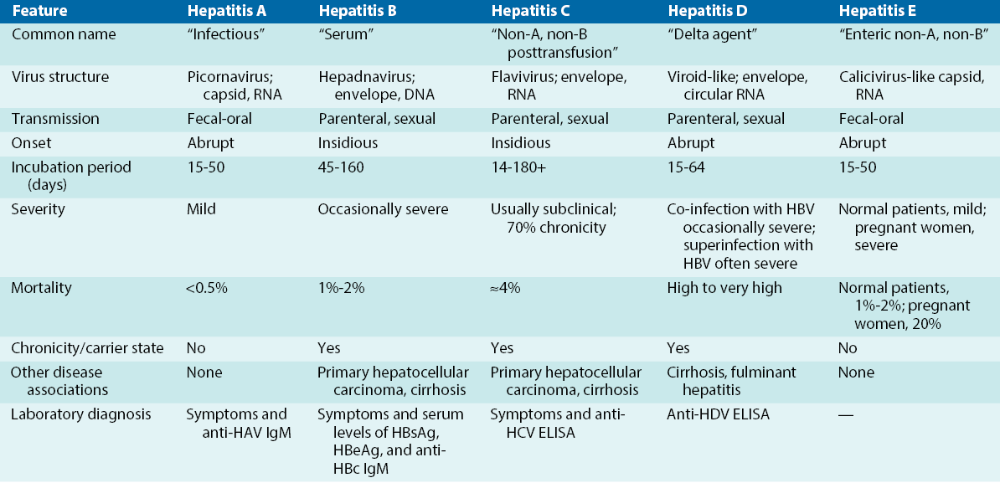{ width=100% style="display: block; margin-left: auto; margin-right: auto; border-radius: 8px;" }

## Comparative features of hepatitis viruses

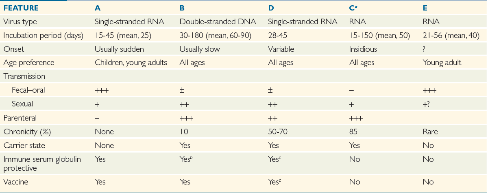{ width=100% style="display: block; margin-left: auto; margin-right: auto; border-radius: 8px;" }

# HEPATITIS A VIRUS

## Overview

- Acute hepatitis by HAV (_Picornaviridae_, Hepatovirus)
- Fecal–oral spread: contaminated food/water, shellfish, close contact
- Incubation 15–50 days (≈25); children often asymptomatic
- Dx: anti‑HAV IgM (acute); IgG = past infection/vaccine
- 99% of healthy adults self-limiting, develop lifelong immunity
- Prevention: hygiene, immune globulin post‑exposure, inactivated vaccine

## Structure{.font14}
:::{.columns}
:::{.column width="65%"}
- Virion: non-enveloped, icosahedral, ~27 nm
- Genome: +ssRNA (~7.5 kb) with VPg at 5′ and poly(A) tail at 3′
- Expression: single ORF → polyprotein, cleaved into structural (VP1–VP4) and nonstructural proteins
- Environmental stability: acid- and solvent-resistant; persists in water/food; inactivated by chlorination, adequate heat (>60 °C), formalin, or UV
:::
:::{.column width="35%"}
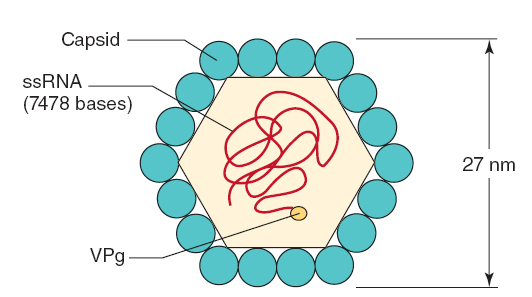{ width=100% }
:::
:::

## Replication {.font14}

:::{.columns}
:::{.column width="60%"}
- Receptor: TIM‑1 (HAVCR1) on hepatocytes
- Entry: receptor‑mediated endocytosis → uncoating in endosome
- Genome: +ssRNA (~7.5 kb, VPg‑linked) — serves as mRNA
- Translation/replication: single ORF → polyprotein → proteolytic cleavage
- Assembly/release: cytoplasmic capsid assembly; released non‑enveloped
- Tropism: hepatocytes
:::
:::{.column width="40%"}
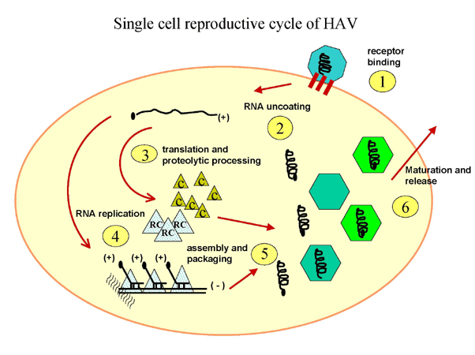{ width=100% }
:::
:::

## Pathogenesis

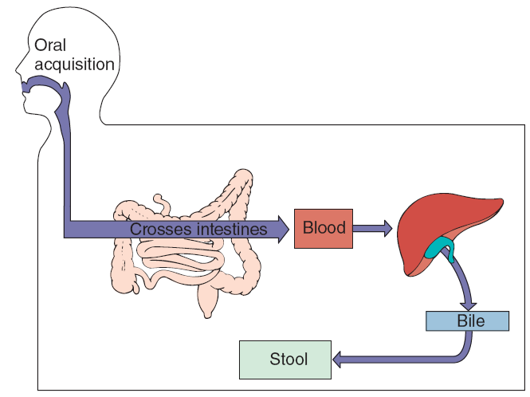{ width=100% style="display: block; margin-left: auto; margin-right: auto; border-radius: 8px;"}

## Pathogenesis and immunity
- Entry: ingestion → replicates in oropharyngeal/intestine → primary viremia → hepatocytes/Kupffer cells
- Liver injury: immune‑mediated (T cells); minimal direct cytopathic effect
- Shedding: high fecal viral load ~10–14 days before jaundice; peaks at symptom onset
- Immunity: anti‑HAV IgM in acute, replaced by durable IgG → lifelong immunity
- Outcome: usually self‑limited (incubation ~15–50 days); fulminant hepatitis rare (~0.1%)

## Epidemiology

- Reservoir: humans (chimpanzees experimentally susceptible)
- Distribution: worldwide; highest where sanitation is poor
- Risk factors: poor sanitation, contaminated food/water, crowded settings, travel
- Outcomes/immunity: usually self‑limited; fulminant disease rare; anti‑HAV IgG = long‑lasting immunity

## Clinical syndromes 

- Most infections are asymptomatic, especially in children
- Incubation/shedding: 15–50 days (mean ~25); fecal shedding peaks ~1–2 weeks before symptoms
- Adults: abrupt onset of fever, fatigue, nausea, anorexia, and abdominal pain; jaundice in ~70–80%
- Children (<6 years): usually mild or asymptomatic; jaundice ≈10%
- Course: symptoms intensify for several days before the icteric phase; ~99% recover, fulminant hepatitis is rare (~0.1%)

## Clinical syndromes

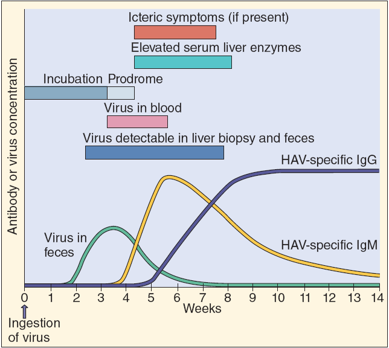{ width=100% style="display: block; margin-left: auto; margin-right: auto; border-radius: 8px;" }

## Laboratory diagnosis

- Anti‑HAV IgM (EIA/ELISA) — indicates acute/recent infection
- Anti‑HAV IgG — past infection or vaccine‑induced immunity
- HAV RNA (RT‑PCR, stool or serum) — early detection and outbreak/genotyping
- Specimens: serum/plasma for serology; stool or serum for PCR

## Treatment, prevention, and control

- Treatment: supportive care — rest, fluids, nutrition
- Prevent fecal–oral spread: safe water and food, hand hygiene, avoid raw shellfish
- Water: boil or chlorinate to inactivate HAV
- Post‑exposure: immune globulin within 2 weeks
- Vaccination: inactivated vaccine, recommended for travelers and high‑risk groups

# HEPATITIS B VIRUS

## Overview {.font14}

- Hepatitis B in family _Hepadnaviridae_
- Tropism: primarily hepatocytes
- Transmission: blood, sexual contact, perinatal
- Incubation: 6 weeks–6 months (average ~90 days)
- Chronicity: ~5–10% in adults; up to 90% in perinatal infections
- Complications: cirrhosis and hepatocellular carcinoma
- Diagnosis: HBsAg, HBeAg, anti-HBc, HBV DNA testing

::: {.callout-note}
Global burden: >250 million chronic infections and ~1 million deaths/year
:::

## Overview start 3.30 -> 10.37min (cont.)
<iframe width="1200" height="650" src="https://www.youtube.com/embed/tuWWtTuc2cw" title="https://www.youtube.com/embed/tuWWtTuc2cw" frameborder="0" allow="accelerometer; autoplay; clipboard-write; encrypted-media; gyroscope; picture-in-picture" allowfullscreen></iframe>

## Structure {.smaller}

:::{.columns}
:::{.column width="60%"}
- Genome: dsDNA ≈3.2 kb; repairs to cccDNA
- Particles
  - Dane (envelop + core + DNA): infectious enveloped virion (~42 nm)
  - Subviral (envelop only): noninfectious HBsAg spheres/filaments (abundant)

- Proteins
  - HBsAg (S/M/L): envelope, attachment
  - HBcAg: capsid
  - HBeAg: secreted marker of active replication
  - Polymerase (P): primer + reverse transcriptase + RNase H
  - HBx: linked to pathogenesis/oncogenesis
:::
:::{.column width="40%"}
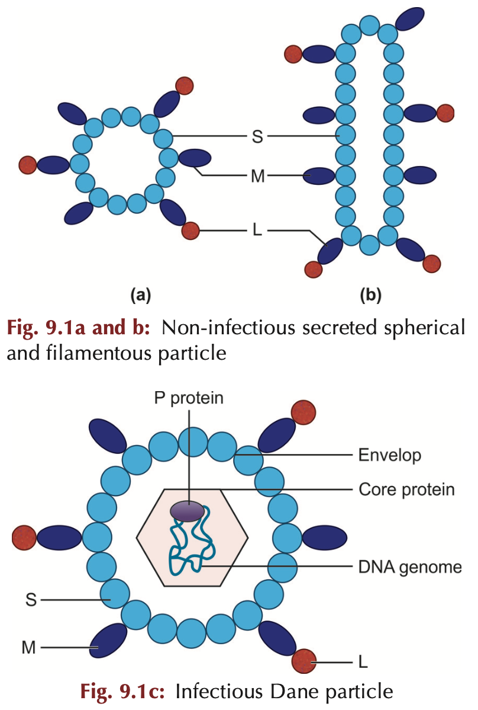{ width=80% }
:::
:::

## Structure (cont.)
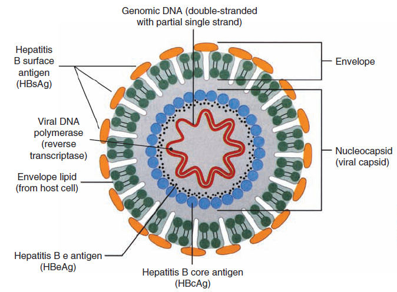{ width=35% .absolute left=100px top=100px }
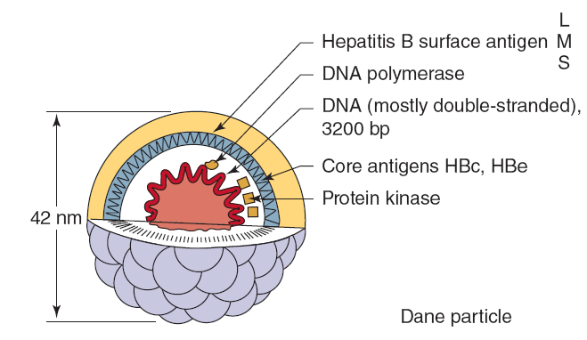{ width=45% .absolute right=20px top=100px }

<!-- ## Structure

{ width=70% }

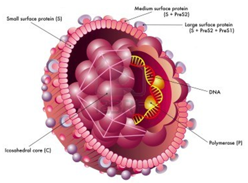{ width=70% }

{ width=70% }

-->

## Replication

- Tropism: hepatocytes
- Entry: endocytosis → nucleocapsid to nucleus
- Genome: partial ds rcDNA → repaired to cccDNA
- Transcription/replication: host Pol II → pgRNA; viral RT → rcDNA
- Assembly/release: bud into ER/Golgi, acquire HBsAg; excess subviral HBsAg released
- Integration: occasional host DNA integration → oncogenesis

## Replication (cont.)

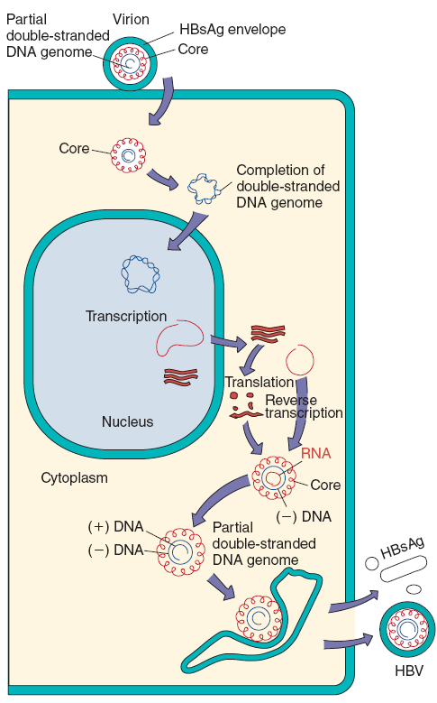{ width=320px .absolute left=300px}

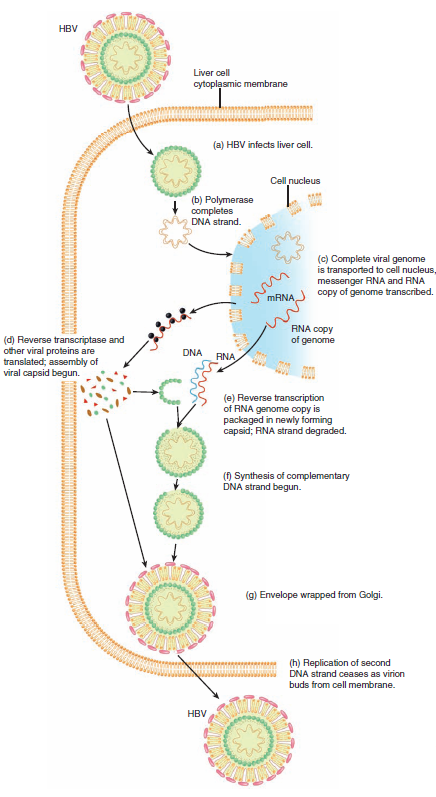{ width=320px .absolute right=300px}

## Pathogenesis and immunity {.font14}

- Outcomes: asymptomatic, acute, or chronic disease
- Transmission: blood, sexual, perinatal; virus present in various body fluids
- Liver injury: immune‑mediated; HBV itself is minimally cytopathic
- Incubation: weeks–months (≈90 days); cccDNA persistence enables latency
- Clearance requires strong multispecific CD4+/CD8+ responses + anti‑HBs; weak/tolerant responses → chronicity
- Chronic sequelae: fibrosis, cirrhosis, HCC; HBeAg/HBsAg indicate high replication

## Pathogenesis and immunity {.font14}

- Acute: hepatocellular swelling
- Infiltrate: lymphocytes with Kupffer cell activation
- Injury: immune‑mediated cytotoxic T cell killing, minimal direct viral cytopathy
- Resolution: strong CD4+/CD8+ responses and anti‑HBs → viral clearance and regeneration
- Chronicity: weak/tolerant immunity → persistent infection, fibrosis, cirrhosis, ↑ HCC risk
- Markers: HBeAg and high HBV DNA = active replication; HBsAg loss and anti‑HBs = recovery

## Pathogenesis

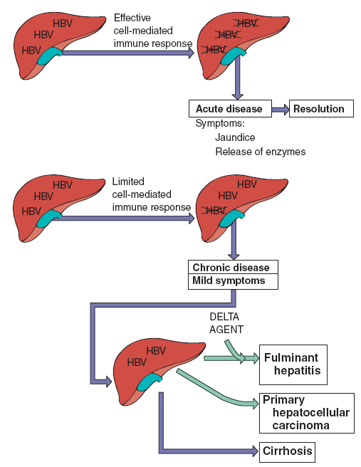{ width=100% style="display: block; margin-left: auto; margin-right: auto; border-radius: 8px;" }

## Epidemiology{.font14}

- Global burden: ~296 million chronically infected; ~820,000 deaths/year
- Highest prevalence: sub‑Saharan Africa, East/Southeast Asia, Amazon, Pacific Islands
- Main transmission routes: perinatal (mother→infant), early‑childhood, sexual contact, percutaneous exposures (blood, unsafe injections, IDU)
- High‑risk groups: infants of HBsAg+ mothers, people from endemic regions, people who inject drugs, MSM, healthcare workers, hemodialysis/transfusion recipients
- Key controls: timely birth‑dose and routine infant vaccination, maternal screening + antivirals in pregnancy, safe blood/injection practices, harm‑reduction services

## Clinical syndromes for acute infection {.font14}
- Incubation: prolonged (weeks–months); often insidious onset
- Prodrome: fever, malaise, anorexia → nausea, vomiting, abdominal discomfort, myalgias
- Icteric phase: jaundice, dark urine, pale stools, pruritus
- Course: severity variable; adults more often symptomatic than children
- Fulminant hepatitis: rare (~1%) — acute liver failure with encephalopathy, coagulopathy, ascites, and bleeding
- Immune‑complex–mediated extrahepatic manifestations: rash, arthralgia/polyarthritis, serum‑sickness–like illness, necrotizing vasculitis, and glomerulonephritis

## Clinical syndrom for chronic infection (cont.) {.font14}
- Progression: ~5–10% of adult infections become chronic; much higher after perinatal exposure
- Clinical states:
  - Inactive carrier: HBsAg positive with low/undetectable HBV DNA and normal ALT — minimal ongoing liver injury
  - Chronic active hepatitis: persistent inflammation → progressive fibrosis, cirrhosis, liver failure
- Complications: cirrhosis and HCC. Mechanisms include chronic inflammation and occasional viral DNA integration into the host genom
- Latency to HCC: highly variable (reported ≈9–35 years or longer)

## Clinical syndromes for chronic infection (cont.)
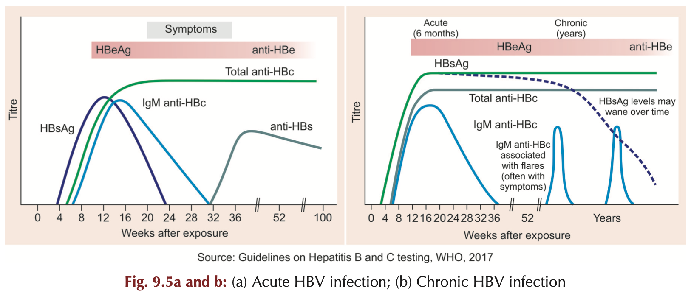{ width=100% style="display: block; margin-left: auto; margin-right: auto; border-radius: 8px;" }

<!-- 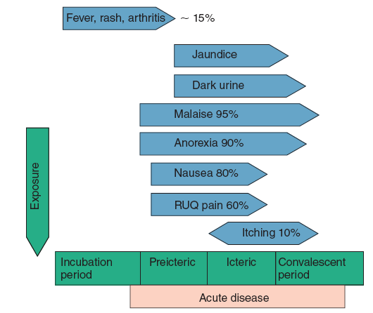{ width=70% }

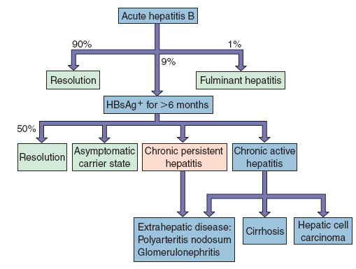{ width=70% }

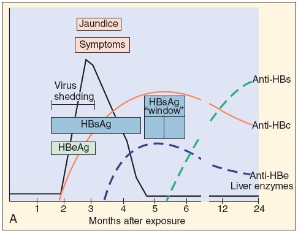{ width=70% }

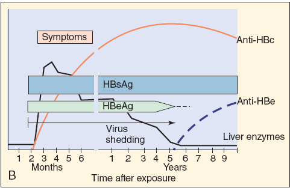{ width=70% } -->

## Laboratory diagnosis{.font14}

- Initial evaluation
  - Clinical assessment + LFTs ALT AST ALP total bilirubin
  - CBC and coagulation INR if severe

- Staging and specimens
  - FibroScan or liver biopsy for fibrosis
  - Serum or plasma for testing

- Molecular testing
  - HBV DNA quantitative PCR — viral load and treatment guide
  - Genotype testing when indicated

## Laboratory diagnosis (cont.)
- Serology
  - HBsAg — current infection
  - HBeAg — high replication and infectivity
  - Anti-HBs — immunity from recovery or vaccine
  - Anti-HBc IgM — recent infection
  - Anti-HBc total — prior or current infection not from vaccine

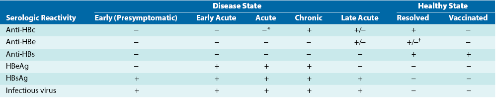{ width=100% style="display: block; margin-left: auto; margin-right: auto; border-radius: 8px;" }

:::{.notes}
- HBeAg: secreted during active replication; indicates high infectivity
- Anti-HBc IgM: marker of recent infection; persists ~6 months
:::

## Treatment prevention and control {.font14}

- Acute HBV
  - Supportive care and monitoring
  - Antivirals for fulminant or severe disease per specialist

- Chronic HBV
  - Goals suppress viral replication prevent progression to cirrhosis and HCC
  - First-line antivirals tenofovir disoproxil fumarate TDF tenofovir alafenamide TAF entecavir
  - Pegylated interferon for selected patients
  - Avoid agents with high resistance when possible

## Treatment prevention and control (cont.) {.font14}

- Prevention and public health
  - 💉 Infant vaccination with timely birth dose within 24 hours
  - 🩸 Screening of blood, organ donors, and pregnant women
  - Safe injection practices, needle exchange, harm reduction, safe sex counseling

 

- Patient counselling
  - 💬 Explain transmission routes, alcohol avoidance, adherence to monitoring/therapy

# HEPATITIS C VIRUSES

## Overview

- Major cause of non‑A/non‑B hepatitis, formerly common post‑transfusion
- ~170 million global carriers, ~4 million in US
- Bloodborne transmission with high chronicity
- Chronic infection → cirrhosis and hepatocellular carcinoma
- Incubation 6–12 weeks

## Structure{.font14}
:::{.columns}
:::{.column width="60%"}
- Genus Hepacivirus
- Family Flaviviridae
- Size 30–60 nm
- Envelope, icosahedral
- Genome +ssRNA ~9.1 kb single ORF
- Encodes ~10 proteins
- Envelope glycoproteins E1 E2
:::
:::{.column width="40%"}
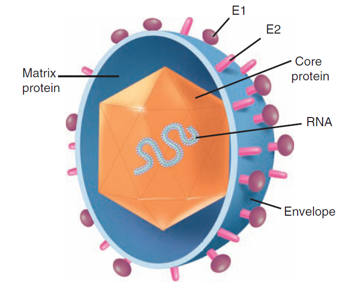{ width=70% }
:::
:::

## Replication {.font14}

:::{.columns}
:::{.column width="65%"}
- Host: humans and chimpanzees
- Entry: receptor-mediated endocytosis and endosomal fusion
- Genome: +ssRNA functions as mRNA → translated → polyprotein 
- Replication: (+)RNA → dsRNA replicative intermediate → new (+) genomes
- Assembly/release: buds into ER as lipoviroparticles
- Immune evasion: inhibits IFN signaling and apoptosis (PKR, TNF pathways)
:::
:::{.column width="35%"}
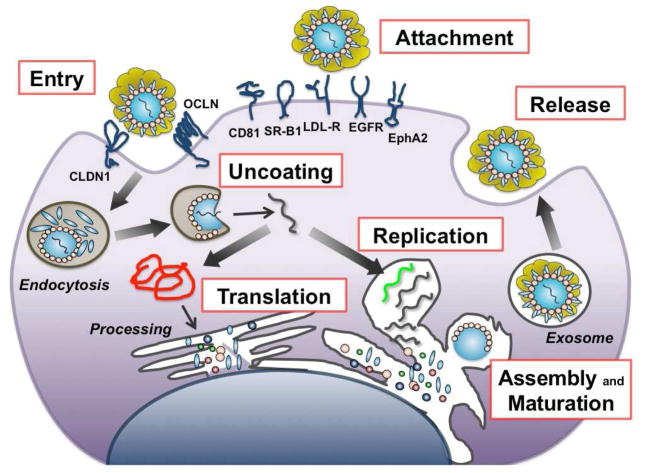{ width=100% }
:::
:::
<!-- 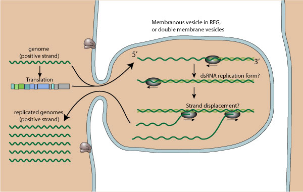{ width=70% }
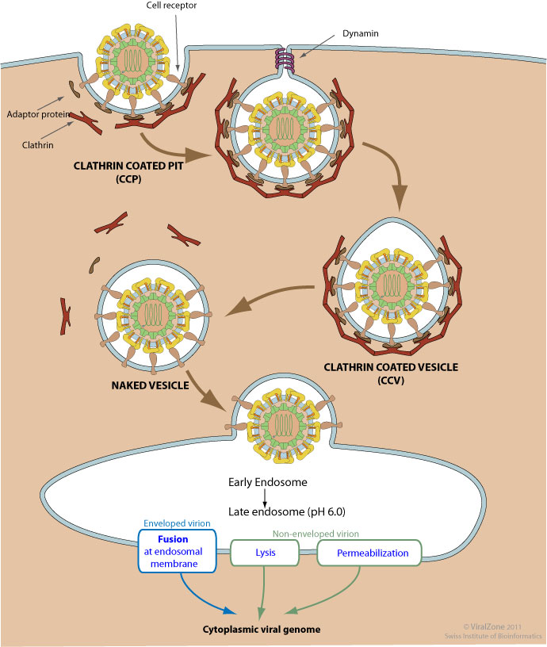{ width=70% } -->

## Pathogenesis and immunity {.font14}

- Invades B and T lymphocytes and monocytes then infects hepatocytes
- Promotes cell survival leading to persistent infection
- Cell-mediated immunity mediates viral clearance and liver injury
- Chronic infection exhausts CD8 T cells and impairs viral elimination
- Histology shows inflammation, portal and periportal fibrosis, and lobular necrosis
- Chronic inflammation and regeneration increase hepatocellular carcinoma risk
- Anti-HCV antibodies are not protective

## Epidemiology

- Transmission: bloodborne, sexual
- High risk: people who inject drugs, transfusion/organ recipients, tattoo recipients, hemophiliacs
- Global burden: ~58 million chronically infected, ~350k deaths/year

## Clinical syndromes

- Acute: often asymptomatic; ~15% clear infection
- Chronic: ~70–80% progress to chronic infection with risk of cirrhosis and HCC
- Common symptom: persistent fatigue

## Diagnosis, treatment and prevention

- Anti‑HCV antibody screening, confirm with HCV RNA by RT-PCR
- Use viral load for treatment monitoring

- Direct‑acting antivirals (E.g Glecaprevir) achieve cure in >90% of cases
- Prevent: blood screening, harm reduction (needle programs), safe tattooing, avoid alcohol

# HEPATITIS G VIRUS

## Overview & transmission
- GBV‑C (human pegivirus, HPgV) — enveloped, +ssRNA, ≈9.3 kb
- Bloodborne, sexual, and perinatal spread
- Often chronic and asymptomatic

## Clinical significance
- No consistent link to clinical hepatitis
- Clearance associated with anti‑E2 antibodies

## Diagnosis
- GBV‑C RNA by RT‑PCR for active infection
- Anti‑E2 indicates prior cleared infection

## Treatment & prevention
- No specific therapy or vaccine
- Prevent via blood safety and infection control

:::{.notes}
This virus first discovered in patients with unexplained hepatitis in the 1990s.
It is not linked to hepatitis.
Name GBV-C: George Bush Hospital 
:::

# HEPATITIS D VIRUS

## Overview

- HDV infects ~15 million people worldwide and increases fulminant hepatitis risk
- Defective satellite virus requiring HBsAg for assembly and spread
- Relies on HBV for envelope and hepatocyte entry
- Encodes one protein and depends on host enzymes for replication

## Structure and replication {.font14}
:::{.columns}
:::{.column width="65%"}
- Genome: circular negative ssRNA ~1700 nt forming rodlike structure by base pairing
- Virion: ~35–37 nm, delta Ag core wrapped by HBsAg envelope
- Delta antigen: small 24 kDa and large 27 kDa forms with distinct roles
- Replication: host RNA polymerase II transcribes genome, ribozyme cleavage, RNA editing generates large delta Ag for packaging
:::
:::{.column width="35%"}
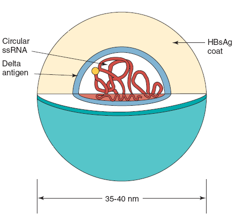{ width=100% style="display: block; margin-left: auto; margin-right: auto; border-radius: 8px;" }
:::
:::

## Pathogenesis

- Occurs only with HBV coinfection or superinfection
- Superinfection of chronic HBV often causes more severe and rapidly progressive liver disease
- Liver injury from direct cytopathic effects of HDV plus immune mediated damage

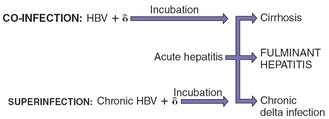{ width=70% style="display: block; margin-left: auto; margin-right: auto; border-radius: 8px;" }

## Diagnosis

- HDV RNA by RT‑PCR or anti‑HDV antibodies by ELISA
- Test patients with acute or severe HBV disease and chronic HBV carriers with worsening liver injury

## Treatment and prevention

- No widely approved specific antiviral for HDV in many regions
- Manage underlying HBV and refer to hepatology for emerging therapies and trials
- Prevent HDV by HBV vaccination and blood safety measures

# HEPATITIS E VIRUS

## Hepatitis E virus

- HEV: fecal–oral, waterborne outbreaks from contaminated water
- Taxonomy: Hepeviridae, genus Hepevirus
- Structure: nonenveloped icosahedral +ssRNA, ~27–34 nm
- Epidemiology: outbreaks in low‑resource regions; sporadic zoonotic cases elsewhere
- Genotypes: 1–2 mainly human (waterborne); 3–4 zoonotic (pigs)

## Hepatitis E virus (cont.)
- Clinical: acute, HAV‑like illness; usually not chronic in immunocompetent hosts
- Severity: mortality ~1–2%; markedly higher (~20%) in third‑trimester pregnancy
- Prevention: safe water, sanitation, hygiene; vaccine licensed in some countries
- Diagnosis: anti‑HEV IgM and HEV RNA by RT-PCR for acute infection

# Quiz

## Which of the following Hepatitis viruses is typically transmitted through the fecal-oral route?{.quiz-question}

- Hepatitis B  
- Hepatitis C  
- [Hepatitis A]{.correct}  
- Hepatitis D  

## Which Hepatitis virus is most likely to cause chronic infection in adults?{.quiz-question}

- Hepatitis A  
- [Hepatitis B]{.correct}  
- Hepatitis E  
- Hepatitis G  

## What is the primary mode of transmission for Hepatitis C virus?{.quiz-question}

- Fecal-oral  
- [Bloodborne]{.correct}  
- Sexual contact only  
- Airborne  

## Which Hepatitis virus requires coinfection with Hepatitis B virus to replicate?{.quiz-question}

- Hepatitis A  
- Hepatitis C  
- [Hepatitis D]{.correct}  
- Hepatitis E  

## What is the most effective prevention method for Hepatitis B virus infection?{.quiz-question}

- Hand washing  
- [Vaccination]{.correct}  
- Safe water  
- Condom use  

## Which Hepatitis virus has the highest mortality rate during pregnancy?{.quiz-question}

- Hepatitis A  
- Hepatitis B  
- Hepatitis C  
- [Hepatitis E]{.correct}

## What type of genome does Hepatitis B virus have?{.quiz-question}

- Single-stranded RNA  
- Double-stranded RNA  
- Single-stranded DNA  
- [Double-stranded DNA]{.correct}

## Which Hepatitis virus is classified in the _Flaviviridae_ family?{.quiz-question}

- Hepatitis A  
- Hepatitis B  
- [Hepatitis C]{.correct}  
- Hepatitis D 

## References
